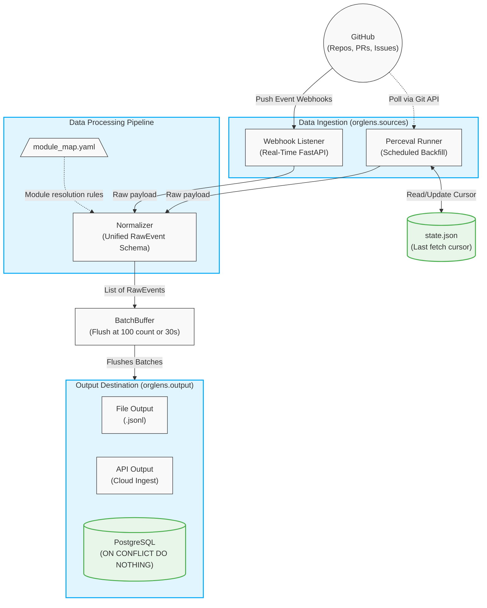

# OrgLens Agent Component Documentation

This document describes the internal components of the **OrgLens Layer 1** local data collection agent.

## Overview

OrgLens Layer 1 is responsible for extracting rich historical and real-time engineering metrics from GitHub. It operates through two complementary ingestion paths:
1. **Perceval Scheduled Backfills:** Polls git, pull request, and issue data at configured intervals (e.g., every 6 hours) to ensure no data is lost.
2. **Real-Time Webhook Listener:** A FastAPI-based HTTP server that receives live events natively pushed by GitHub.

Both paths feed raw unnormalized JSON payloads through a unified `Normalizer`. The normalized `RawEvent` objects are then chunked into batches in the `BatchBuffer`, and finally flushed to a destination `OutputSink` (e.g. cloud API, PostgreSQL, or local files).

### Architecture Flow

---

## The Components

### 1. `Models` (`orglens.models`)
Defines the core data structures passed throughout the system.

- **`RawEvent`** (`orglens/models/raw_event.py`): The single source of truth for events. This Pydantic model accommodates schemas for exactly six event types (`commit`, `pr_open`, `pr_merge`, `pr_review`, `issue_assign`, `issue_close`). All downstream consumers expect exactly this format.
- **`StateManager`** (`orglens/models/state.py`): A lightweight persistence class maintaining a `state.json` file. It stores the timestamp of the last successful data fetch for each combination of repository and event category. This is what enables incremental Perceval fetching using `--from-date`.

---

### 2. `Normalizer` (`orglens.normalizer.normalizer`)
The most complex logic in the system, acting as a translator between raw GitHub payloads (or Perceval dictionaries) into standard `RawEvent`s.

**Key responsibilities:**
- **Module Mapping**: Uses the rules loaded from `module_map.yaml` to resolve file paths into macro subsystem names (e.g. `src/auth/` → `auth`). For commits that touch multiple files, the Normalizer expands one commit into *N* `RawEvent` objects (one for each file touched, allowing true per-file weighting later on).
- **Co-author Extraction**: Uses regex against commit messages to parse `Co-authored-by:` trailers. If detected, "shadow" `RawEvent` entries are emitted to represent the hidden contributors alongside the primary author.
- **Deduplication IDs**: Computes stable SHA1 strings (e.g., `repo|sha|filepath|commit|co_author`) for `event_id`. This allows the Output Sink (e.g. Postgres `ON CONFLICT DO NOTHING`) to safely discard duplicate events that might arrive separately via webhooks and Perceval polling.
- **Format Normalization**: Converts disparate `author_date` string formats (non-ISO standard GitHub formats) into consistent UTC `datetime` objects. Includes robust parsing strategies for numeric string additions like `binary` (`-` lines).

---

### 3. `Sources` (`orglens.sources`)
Responsible for reaching out (or listening) to GitHub.

- **`PercevalRunner`** (`orglens/sources/perceval_runner.py`): Orchestrates `perceval git` and `perceval github` as subprocesses, streaming their output line-by-line using `--json-line`. Rather than buffering entirely in memory, it processes the stdout stream continuously. Uses `asyncio.run_in_executor` to avoid blocking the main event loop while waiting on the sub-processes.
- **`WebhookListener`** (`orglens/sources/webhook_listener.py`): A high-concurrency FastAPI app that exposes `POST /webhook`. Validates the `X-Hub-Signature-256` payload against `config.yaml` HMAC secrets to guarantee payload authenticity, then directly forwards the body to the `Normalizer`.

---

### 4. `BatchBuffer` (`orglens.buffer.batch_buffer`)
Because high-volume repos (or Perceval backfills) emit millions of events, sending individual database or HTTP API queries per-event is unscalable.

- **Threshold Flushes**: Using an `asyncio.Lock()`, this buffer holds events in memory until they meet *either* a `max_events` count (e.g. 100) or a time threshold `flush_interval` (e.g. 30 seconds). At that point, the entire block is flushed.
- **Graceful Shutdown**: Ties into the main agent's signal listener to gracefully flush final events if the process stops.

---

### 5. `Output Sinks` (`orglens.output`)
Handles the final persistence or dispatch of normalized `RawEvent` chunks. Extended via `router.py`.

- **`ApiOutput`** (`orglens/output/api_output.py`): POSTs JSON batch arrays to an external ingest server. Includes resilient retry logic featuring exponential backoff in case of 5xx HTTP network instability.
- **`PgOutput`** (`orglens/output/pg_output.py`): Utilizes high-performance asynchronous `asyncpg` to insert records into a local or remote PostgreSQL database. Automatically defines `CREATE TABLE IF NOT EXISTS` schema on connection. Leverages native Postges `ON CONFLICT (event_id) DO NOTHING`.
- **`FileOutput`** (`orglens/output/file_output.py`): Appends records line-by-line as `.jsonl`. Extremely useful for zero-latency debugging and dry-run benchmarks out-of-the-box.

---

### 6. `Agent Orchestrator` (`orglens/agent.py`)
The system's nervous system. 

Provides CLI abstractions tying the entire cycle.
Parses environment properties via `config.py`, instantiates all core components mentioned above, starts the background buffer timer, mounts the `PercevalRunner` onto an asynchronous schedule via `APScheduler`, and finally serves the `WebhookListener` on an explicit thread. Implements zero-dependency signal hooking for safe exit routines.
