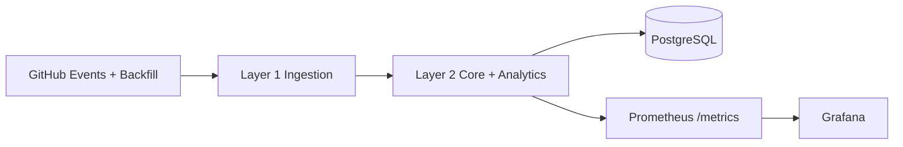

# OrgLens

Lightweight engineering intelligence for repository ownership risk.

OrgLens runs as a simplified 3-layer system:

1. Layer 1: cloud ingestion (webhooks + backfill)
2. Layer 2: core processing + analytics API
3. Layer 3: observability (Prometheus + Grafana)

## Why OrgLens

- Tracks bus factor, ownership drift, and succession risk by module
- Supports webhook-driven ingestion and historical backfill
- Exposes analytics APIs plus Prometheus metrics
- Ships with a ready-to-use Grafana dashboard

## Architecture



Active paths:

- Layer 1: orglens/layers/layer1_cloud/
- Layer 2: orglens/layers/layer2_core/
- Layer 3: infra/local/ and infra/aws/

## Quick Start

```bash
python -m venv .venv
source .venv/bin/activate
pip install -e ".[dev]"
cp config.yaml config.local.yaml
```

Run local core API:

```bash
orglens-core --config config.local.yaml --host 0.0.0.0 --port 8001
```

Run local ingestion service:

```bash
orglens-cloud-ingest --config config.local.yaml --host 0.0.0.0 --port 8080
```

## Local Dashboard

Start full local stack (Postgres + Layer1 + Layer2 + Prometheus + Grafana):

```bash
docker compose -f infra/aws/docker-compose.minimal.yml --env-file .env.aws up -d --build
```

Dashboard URLs:

- Grafana: http://localhost:3000
- Prometheus: http://localhost:9090
- Layer 2 metrics: http://localhost:8001/metrics

Default Grafana login:

- admin / admin

## Key API Endpoints

Layer 1:

- POST /webhook
- POST /api/backfill/start
- GET /api/backfill/status/{job_id}

Layer 2:

- POST /api/ingest
- POST /api/run/analytics
- GET /api/risk/summary?repo=<owner/repo>
- GET /api/trends/weekly?repo=<owner/repo>
- GET /api/overview/forecast?repo=<owner/repo>
- GET /metrics
- GET /health

## One-Command Run

```bash
orglens-auto https://github.com/owner/repo.git --use-remote-aws
```

## Tests

```bash
pytest tests/ -v
```

## Security Notes

- Keep real credentials in local .env.aws only (ignored by git)
- Use .env.aws.example as a template
- Do not commit keys or tokens
