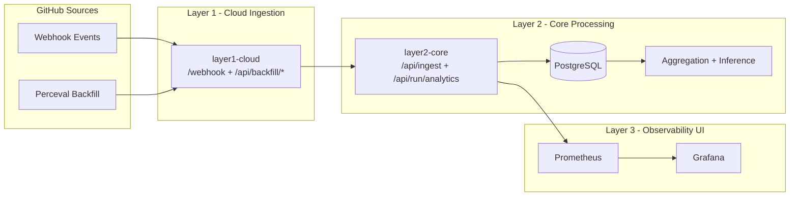

# OrgLens (Simplified 3-Layer Architecture)

> Permanent simplified structure for this repository:
> 1) Layer 1 cloud ingestion, 2) Layer 2 core processing+analytics API, 3) Layer 3 observability (Prometheus+Grafana).

Canonical active code paths:

- Layer 1: `orglens/layers/layer1_cloud/`
- Layer 2: `orglens/layers/layer2_core/` (internally uses `analytics/*` and `observability/*` modules)
- Layer 3: `infra/aws/prometheus/` + `infra/aws/grafana/` (cloud) and `infra/local/` (local)

---

## Architecture (3 Layers Only)



Layer interaction summary:

- Layer 1 receives webhooks/backfill and forwards normalized batches.
- Layer 2 ingests, deduplicates, stores, computes analytics, and exposes metrics/APIs.
- Layer 3 visualizes Layer 2 metrics through Prometheus and Grafana.

```
 ┌──────────────────────────┐     ┌──────────────────────────┐
 │  PATH A: Webhook (live)  │     │  PATH B: Perceval (6 h)  │
 │  push / pull_request /   │     │  git commits             │
 │  pull_request_review /   │     │  github PRs + reviews    │
 │  issues                  │     │  github issues           │
 └────────────┬─────────────┘     └────────────┬─────────────┘
              │                                │
              └──────────────┬─────────────────┘
                             ▼
                      ┌─────────────┐
                      │ Normalizer  │
                      │ module_map  │
                      │ co-authors  │
                      └──────┬──────┘
                             ▼
                    ┌──────────────────┐
                    │  Batch Buffer    │
                    │  100 ev / 30 s   │
                    └──────┬───────────┘
                           ▼
                ┌──────────────────────┐
                │  OutputSink          │
                │  file | api | pg     │
                └──────────────────────┘
```

---

## Quick Start

### 1. Install

```bash
cd /path/to/OrgLens
python -m venv .venv
source .venv/bin/activate
pip install -e ".[dev]"
```

### 2. Configure

```bash
cp config.yaml config.local.yaml
# Edit config.local.yaml — set your repo(s), GitHub token, output target
```

Key fields:

| Field                           | Description                                                   |
| ------------------------------- | ------------------------------------------------------------- |
| `repos[].owner`                 | GitHub org/user                                               |
| `repos[].repo`                  | Repository name                                               |
| `github.token`                  | Personal Access Token (or set `ORGLENS_GITHUB_TOKEN` env var) |
| `webhook.secret`                | HMAC secret registered in GitHub webhook settings             |
| `output.target`                 | `api` (default) \| `file` \| `pg`                             |
| `scheduler.poll_interval_hours` | How often Perceval runs (default: `6`)                        |

### 3. Customize the Module Map

Edit `module_map.yaml` to match your repository's directory structure:

```yaml
modules:
  auth:
    prefixes: ["src/auth/", "apps/accounts/"]
  payments:
    prefixes: ["src/payments/", "billing/"]
default_module: "other"
```

### 4. Run

**Development (file output, no webhooks needed):**

```bash
# One-time Perceval backfill → events.jsonl
ORGLENS_CONFIG=config.local.yaml orglens-agent --output file --run-once
cat events.jsonl | python -m json.tool | head -60
```

**Daemon mode (webhook + Perceval scheduler):**

```bash
ORGLENS_CONFIG=config.local.yaml orglens-agent --output file
# Webhook listening on http://localhost:8080/webhook
# Health check: http://localhost:8080/health
```

**Send a test webhook (simulates a GitHub push):**

```bash
curl -X POST http://localhost:8080/webhook \
  -H "X-GitHub-Event: push" \
  -H "X-Hub-Signature-256: sha256=skip" \
  -H "Content-Type: application/json" \
  -d @tests/fixtures/push_payload.json
```

> Set `webhook.skip_signature_check: true` in `config.local.yaml` when testing locally.

---

## Output Targets

| Flag            | Description                                        |
| --------------- | -------------------------------------------------- |
| `--output file` | Append JSONL to `events.jsonl` (local development) |
| `--output api`  | POST batches to `output.api.url` with API key      |
| `--output pg`   | Insert into local PostgreSQL `raw_events` table    |

For cloud API mode, Layer 1 now supports two auth styles:

- `output.api.auth_scheme: x-api-key` (sends `X-Api-Key`)
- `output.api.auth_scheme: bearer` (sends `Authorization: Bearer ...`)

Optional hardening for internet-facing ingestion:

- Set `output.api.signing_secret` in Layer 1 and `layer2.api.signing_secret` in Layer 2 to the same value.
- Layer 1 sends `X-Orglens-Timestamp` and `X-Orglens-Signature` (`sha256=<hmac>`).
- Layer 2 verifies signature and rejects unsigned/tampered payloads with `401`.
- `layer2.api.signature_tolerance_seconds` controls replay window (default `300`).

---

## Event Types

| `event_type`   | Source             | Key fields                                                            |
| -------------- | ------------------ | --------------------------------------------------------------------- |
| `commit`       | git + push webhook | `sha`, `files_changed`, `lines_added/deleted`, `co_authors`, `module` |
| `pr_open`      | GitHub PR          | `pr_number`, `requested_reviewers`                                    |
| `pr_merge`     | GitHub PR          | `pr_number`, `merged_by`                                              |
| `pr_review`    | GitHub PR review   | `pr_number`, `reviewer`, `verdict`                                    |
| `issue_assign` | GitHub issue       | `issue_number`, `assignees`, `labels`                                 |
| `issue_close`  | GitHub issue       | `issue_number`, `closer`, `labels`                                    |

---

## Running Tests

```bash
pytest tests/ -v
```

No external services required — tests use in-memory fakes and temp files.

---

## Layer 2 Core API

Run the active core service:

```bash
orglens-core --config config.local.yaml
```

Layer 2 endpoints (active):

- `POST /api/ingest` (returns `202 Accepted` immediately)
- `GET /health`
- `GET /api/ingest/status`

---

Run analytics computation from Layer 2 (aggregator + inference):

```bash
curl -X POST http://localhost:8001/api/run/analytics \
  -H "Authorization: Bearer $ORGLENS_API_KEY" \
  -H "Content-Type: application/json" \
  -d '{"repo":"owner/repo","log_level":"INFO"}'
```

Observability endpoints exposed by Layer 2:

- `GET /api/repos`
- `GET /api/risk/summary?repo=<owner/repo>`
- `GET /api/busfactor?repo=<owner/repo>&module=<module>&window=30`
- `GET /api/drift?repo=<owner/repo>&module=<module>`
- `GET /api/succession?repo=<owner/repo>`
- `GET /api/whatif?repo=<owner/repo>&remove_actor=<login>`
- `GET /api/trends/weekly?repo=<owner/repo>`
- `GET /api/overview/forecast?repo=<owner/repo>` (optional LLM narrative + raw trend/risk payload)
- `GET /metrics`
- `GET /health`

Optional LLM overview configuration (inside Layer 2 observability module):

- `ORGLENS_LLM_ENABLED=true`
- `ORGLENS_LLM_API_KEY=<provider-key>`
- `ORGLENS_LLM_MODEL=gpt-4o-mini` (or another provider-compatible model)
- `ORGLENS_LLM_API_URL=https://api.openai.com/v1/chat/completions` (OpenAI-compatible API)

### Local Prometheus + Grafana (no AWS)

Run local observability stack against your local `orglens-core`:

```bash
# 1) Start Layer 2 core locally
orglens-core --config config.local.yaml

# 2) In a second terminal, start local observability
docker compose -f infra/local/docker-compose.observability.yml up -d
```

Local URLs:

- Prometheus: `http://localhost:9090`
- Grafana: `http://localhost:3000`

Default Grafana login (override via environment variables before compose up):

- `GRAFANA_ADMIN_USER=admin`
- `GRAFANA_ADMIN_PASSWORD=admin`

Optional local Postgres datasource overrides for Grafana:

- `ORGLENS_PG_HOST` (default: `host.docker.internal`)
- `ORGLENS_PG_PORT` (default: `5432`)
- `ORGLENS_PG_DB` (default: `orglens`)
- `ORGLENS_PG_USER` (default: `orglens`)
- `ORGLENS_PG_PASSWORD` (default: `orglens`)

---

## One Command For Any Public Repo

Use the combined pipeline command to fetch, normalize, and persist in one run:

```bash
orglens-pipeline \
  --repo-url https://github.com/owner/repo.git \
  --config config.local.yaml
```

Optional flags:

- `--from-date 2026-01-01T00:00:00Z` to bound historical fetch.
- `--github-token <token>` to override config/env token (useful for rate limits).
- `--report-file reports/my_run.json` to choose output report path.

This command keeps Layer 1 and Layer 2 standalone CLIs intact while adding a convenience end-to-end path.

### Minimal Cloud End-to-End (Recommended)

For a simplified working flow against the cloud stack, use:

```bash
scripts/run_minimal_pipeline.sh --repo-url https://github.com/owner/repo.git
```

What it does automatically:

- Resolves repository `created_at` from GitHub API (or uses `--from-date` override).
- Runs ingestion pipeline in cloud.
- Runs aggregation and inference once.
- Verifies risk summary and metrics for that repository.
- Enforces one-repo-at-a-time mode by clearing prior repo data before run.
- Locks processing to a single active repository across ingest + analytics.

Useful optional flags:

- `--from-date <ISO8601>`
- `--host <stack-ip-or-dns>`
- `--run-timeout <seconds>`
- `--single-repo-mode <0|1>` (`1` is mandatory)

### Fully Automatic Cloud CLI

For direct CLI orchestration with no manual layer steps:

```bash
orglens-auto https://github.com/owner/repo.git \
  --layer1-url http://<stack-host>:8080 \
  --core-url http://<stack-host>:8001
```

For local command usage that should directly target the remote AWS stack:

```bash
orglens-auto https://github.com/owner/repo.git --use-remote-aws
```

Optional host override:

```bash
orglens-auto https://github.com/owner/repo.git --use-remote-aws --aws-host <stack-host>
```

Useful optional flags for remote runs:

- `--preflight-timeout 10` to fail fast when remote endpoints are unavailable.

This command performs end-to-end flow automatically:

- Mandatory single-repo reset in Layer 2.
- Layer 1 backfill kickoff.
- Wait for queue drain in Layer 2.
- Run analytics inside Layer 2 core scoped to that repo only.
- Return risk summary and weekly trend/forecast output.

---

## Environment Variables

| Variable                        | Used For                                       |
| ------------------------------- | ---------------------------------------------- |
| `ORGLENS_CONFIG`                | Path to config file                            |
| `ORGLENS_GITHUB_TOKEN`          | GitHub Personal Access Token                   |
| `ORGLENS_WEBHOOK_SECRET`        | Webhook HMAC secret                            |
| `ORGLENS_API_KEY`               | Cloud ingest API key                           |
| `ORGLENS_INGEST_SIGNING_SECRET` | Optional Layer 1 → Layer 2 HMAC signing secret |

---

## State File

`state.json` tracks the last successful Perceval fetch per repo and event type so incremental runs always start from the right checkpoint. It is created automatically on first run.
