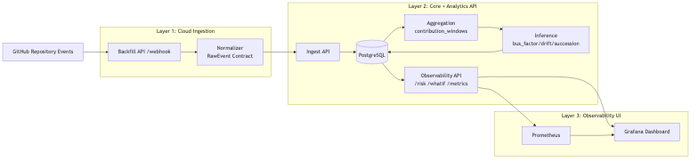

# OrgLens

Lightweight engineering intelligence for repository ownership risk.

OrgLens runs as a simplified 3-layer system:

1. Layer 1: cloud ingestion (webhooks + backfill)
2. Layer 2: core processing + analytics API
3. Layer 3: observability (Prometheus + Grafana)

## Why OrgLens

- Tracks bus factor, ownership drift, and succession risk by module
- Supports webhook-driven ingestion and historical backfill
- Exposes analytics APIs plus Prometheus metrics
- Ships with a ready-to-use Grafana dashboard

## Architecture



Active paths:

- Layer 1: orglens/layers/layer1_cloud/
- Layer 2: orglens/layers/layer2_core/
- Layer 3: infra/local/ and infra/aws/

## Quick Start

```bash
python -m venv .venv
source .venv/bin/activate
pip install -e ".[dev]"
cp config.yaml config.local.yaml
```

Run local core API:

```bash
orglens-core --config config.local.yaml --host 0.0.0.0 --port 8001
```

Run local ingestion service:

```bash
orglens-cloud-ingest --config config.local.yaml --host 0.0.0.0 --port 8080
```

## Local Dashboard

Start full local stack (Postgres + Layer1 + Layer2 + Prometheus + Grafana):

```bash
docker compose -f infra/aws/docker-compose.minimal.yml --env-file .env.aws up -d --build
```

Dashboard URLs:

- Grafana: http://localhost:3000
- Prometheus: http://localhost:9090
- Layer 2 metrics: http://localhost:8001/metrics

Default Grafana login:

- admin / admin

## Key API Endpoints

Layer 1:

- POST /webhook
- POST /api/backfill/start
- GET /api/backfill/status/{job_id}

Layer 2:

- POST /api/ingest
- POST /api/run/analytics
- GET /api/risk/summary?repo=<owner/repo>
- GET /api/trends/weekly?repo=<owner/repo>
- GET /api/overview/forecast?repo=<owner/repo>
- GET /metrics
- GET /health

## One-Command Run

```bash
orglens-auto https://github.com/owner/repo.git --use-remote-aws
```

## Single-Repo Mode (Important)

OrgLens enforces strict single-repo processing at runtime. Only one repository can be active at a time.

If you send analytics/backfill for a different repository while another repo is active, Layer 2 returns:

- `Single-repo mode enforced: active repo is <owner/repo>`

### Switch to a New Repository

1. Reset active repository data:

```bash
curl -X POST http://localhost:8001/api/admin/reset-repo-data
```

2. Run pipeline for the new repository:

```bash
orglens-auto https://github.com/new-owner/new-repo.git --use-remote-aws
```

3. If you changed environment/config values, restart stack:

```bash
docker compose -f infra/aws/docker-compose.minimal.yml --env-file .env.aws up -d --build
```

Note: For a normal repo switch, reset + new run is sufficient; full image rebuild is only needed when code or container config changed.

## Tests

```bash
pytest tests/ -v
```

## Validated Achievement Metrics (2026-04-15)

These metrics were produced from reproducible local benchmark runs using three datasets:

- `reports/testsets/baseline_django_batch.json` (5 events)
- `reports/testsets/medium_django_batch.json` (60 events)
- `reports/testsets/edge_django_batch.json` (40 events)

Measured outcomes:

- End-to-end dataset success rate: `3/3` passing (`POST /api/ingest` -> `POST /api/run/analytics` -> `GET /api/overview/forecast`)
- Ingest throughput range: `137.29` to `7892.66` events/sec
- Ingest throughput median: `5195.26` events/sec
- Ingest API latency range: `0.0051s` to `0.0364s`
- Analytics trigger median latency: `0.3211s`
- Forecast endpoint median latency: `0.0071s`

Source of truth:

- Raw run artifact: `reports/session4_achievement_metrics_20260415.json`
- Session 2 health evidence: `reports/session2_validation_20260415.md`
- Session 1 P2 implementation evidence: `reports/session1_p2_implementation_20260415.md`

## Current Live Deployment Metrics (2026-04-15)

Live stack summary:

- EC2 host: `i-096d8bc8afcddedd4`
- Current instance type: `t4g.micro` on `arm64` Ubuntu 24.04
- ALB: `orglens-alb-1887249332.ap-south-2.elb.amazonaws.com`
- Layer 2 health: `{"status":"ok"}`
- Layer 1 health: `{"status":"ok"}`
- Layer 2 metrics: Prometheus text format available at `/metrics`

Observed Prometheus metrics from the live endpoint:

- `orglens_bus_factor`
- `orglens_drift_score`
- `orglens_succession_risk_score`
- `orglens_events_ingested_total`
- `orglens_events_deduplicated_total`
- `orglens_dead_letters_total`
- `orglens_ingestion_lag_ms`
- `orglens_bus_factor_trend`
- `orglens_bus_factor_collapse_warning`

Grafana dashboard check:

- Dashboard loaded for `divyaraj24/OrgLens`
- Live panels are available in Grafana at `http://localhost:3000/`

Operational note:

- The live host is ARM64, so if we plan a resize later the compatible path is another ARM family size such as `t4g.small` or `t4g.medium`.

## Security Notes

- Keep real credentials in local .env.aws only (ignored by git)
- Use .env.aws.example as a template
- Do not commit keys or tokens
